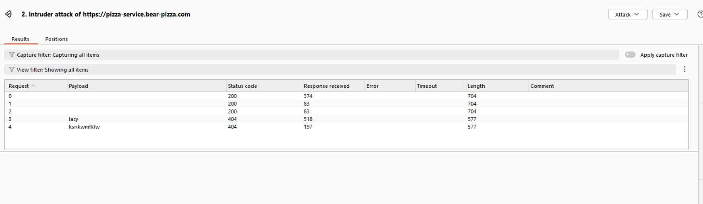

# Penetration Report

This report was completed by **John Barrett** and **Lacy Miller**. Several vulnerabilities were found in both websites and changes were made to address those issues.

## Peer Attacks
### Attack on Lacy by John

| Item           | Result                                                                         |
| -------------- | ------------------------------------------------------------------------------ |
| Date           | December 5, 2025                                                               |
| Target         | https://pizza.lacycs329.click/                                                   |
| Classification | Identification and Authentication Failures                                                                      |
| Severity       | 3                                                                              |
| Description    | I was able to gain access to the website by using a blank password |
| Images         |    Logged into an existing user using a blank password |

---

| Item           | Result                                                                         |
| -------------- | ------------------------------------------------------------------------------ |
| Date           | December 5, 2025                                                               |
| Target         | https://pizza.lacycs329.click/                                                   |
| Classification | Injection                                                               |
| Severity       | 3                                                                            |
| Description    | This endpoint is suseptable to sql injections. |
| Images         |    Injected SQL code |

### Attack on John by Lacy

| Item           | Result                                                                         |
| -------------- | ------------------------------------------------------------------------------ |
| Date           | December 5, 2025                                                               |
| Target         | https://pizza.bear-pizza.com                                                |
| Classification | Identification and Authentication Failures                                                                      |
| Severity       | 3                                                                              |
| Description    | I was able to gain access to the website by using a blank password |
| Images         |    Logged into an existing user using a blank password |

---
| Item           | Result                                                                         |
| -------------- | ------------------------------------------------------------------------------ |
| Date           | December 5, 2025                                                               |
| Target         | https://pizza.bear-pizza.com                                                |
| Classification | Functionality Failures                                                                      |
| Severity       |        2                                                            |
| Description    | I was not able to order pizza's because of the chaos state of the website. This meant that the purpose of the website was failing. |
| Images         |  |

---
---
| Item           | Result                                                                         |
| -------------- | ------------------------------------------------------------------------------ |
| Date           | December 5, 2025                                                               |
| Target         | https://pizza.bear-pizza.com                                                |
| Classification | Functionality Failures                                                                      |
| Severity       | 2                                                                         |
| Description    | I was not able to make a franchise with an empty name which caused problems later |
| Images         |  |

---
# Combined Summary of Learnings

Through peer penetration testing using Burp Suite, we identified several critical vulnerabilities in both JWT Pizza applications that map to OWASP Top 10 categories including Broken Access Control, Injection, Insecure Design, and Identification and Authentication Failures. The most severe vulnerabilities (Severity 3) were authentication bypass with blank passwords and SQL injection in the updateUser endpoint, both of which could allow complete unauthorized access and data manipulation. Additionally, we discovered functionality failures due to overly aggressive chaos engineering (Severity 2) that prevented core pizza ordering functionality, and data validation issues that allowed franchise creation with empty names. Using Burp Suite's Proxy, Intruder, Repeater, and Site Map features, we systematically tested authentication mechanisms, performed brute-force attacks, injected SQL payloads, and analyzed request/response structures to expose these weaknesses. The exercise reinforced critical security principles including defense in depth, mandatory server-side validation, the principle of least privilege, treating all user input as untrusted, continuous security testing throughout the development lifecycle, and controlled chaos engineering that doesn't compromise production functionality. Remediation strategies include implementing strict input validation and sanitization, using parameterized queries, adding database constraints, implementing circuit breakers and graceful degradation, deploying WAF and rate limiting, integrating automated security testing into CI/CD pipelines, and providing regular security training for developers. This penetration testing exercise proved invaluable in demonstrating that security must be built into applications from the ground up with multiple layers of defense, as every input point represents a potential attack vector that must be properly validated and sanitized to prevent complete system compromise.
