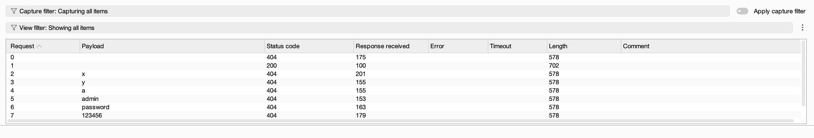
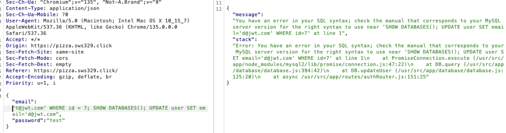
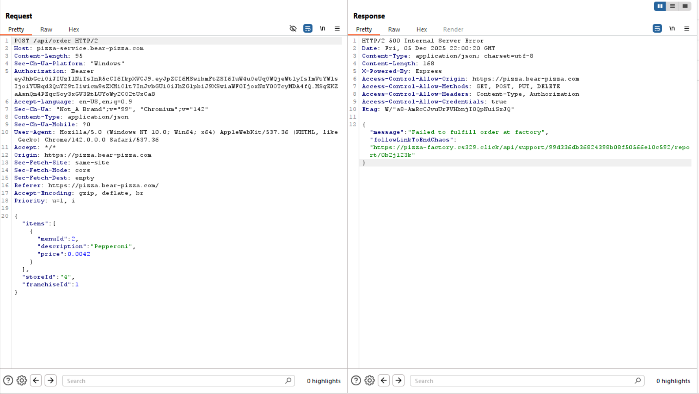
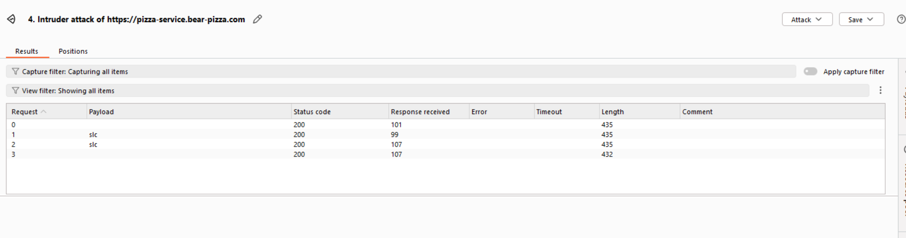

# Penetration Report

This report was completed by **John Barrett** and **Lacy Miller**. Several vulnerabilities were found in both websites and changes were made to address those issues.

## Peer Attacks
### Attack on Lacy by John

| Item           | Result                                                                         |
| -------------- | ------------------------------------------------------------------------------ |
| Date           | December 5, 2025                                                               |
| Target         | https://pizza.lacycs329.click/                                                   |
| Classification | Identification and Authentication Failures                                                                      |
| Severity       | 3                                                                              |
| Description    | I was able to gain access to the website by using a blank password |
| Images         |    Logged into an existing user using a blank password |

---

| Item           | Result                                                                         |
| -------------- | ------------------------------------------------------------------------------ |
| Date           | December 5, 2025                                                               |
| Target         | https://pizza.lacycs329.click/                                                   |
| Classification | Injection                                                               |
| Severity       | 3                                                                            |
| Description    | This endpoint is suseptable to sql injections. |
| Images         |    Injected SQL code |

### Attack on John by Lacy

| Item           | Result                                                                         |
| -------------- | ------------------------------------------------------------------------------ |
| Date           | December 5, 2025                                                               |
| Target         | https://pizza.bear-pizza.com                                                |
| Classification | Identification and Authentication Failures                                                                      |
| Severity       | 3                                                                              |
| Description    | I was able to gain access to the website by using a blank password |
| Images         |    Logged into an existing user using a blank password |

---
| Item           | Result                                                                         |
| -------------- | ------------------------------------------------------------------------------ |
| Date           | December 5, 2025                                                               |
| Target         | https://pizza.bear-pizza.com                                                |
| Classification | Functionality Failures                                                                      |
| Severity       |        2                                                            |
| Description    | I was not able to order pizza's because of the chaos state of the website. This meant that the purpose of the website was failing. |
| Images         |  |

---
---
| Item           | Result                                                                         |
| -------------- | ------------------------------------------------------------------------------ |
| Date           | December 5, 2025                                                               |
| Target         | https://pizza.bear-pizza.com                                                |
| Classification | Functionality Failures                                                                      |
| Severity       | 2       2                                                                     |
| Description    | I was not able to make a franchise with an empty name which caused problems later |
| Images         |  |

---
# Combined Summary of Learnings

The main takeaway we had as we performed these penetration attacks on our own and eachother's websites was the importance of security testing. It's very easy to feel as if your website is secure, when in fact it is vulnerable to critical attacks. One specific thing we learned is the importance of validating input. For example, both websites were vulnerable to the price being changed in an order request, and both websites were vulnerable to registering users on top of existing users, along with other validation problems such as vulnerabilities to SQL injections. In a worst case scenario, the revenue of the company could be significantly impacted, and the whole database could be corrupted or taken down by attackers. Thus by focusing on ensuring that any user input is sanitized or validated, we can eliminate many security vulnerabilities. Also, it's important to throttle user requests so that they don't take down the website in a DDOS attack or attempt to use brute force attacks to obtain user passwords. Often, people use the same password in multiple places, so if an attacker managed to obtain a user's password, they could then try to access their email and even their bank account. Consequently, keeping your website secure is essential to protect your business and your customers.